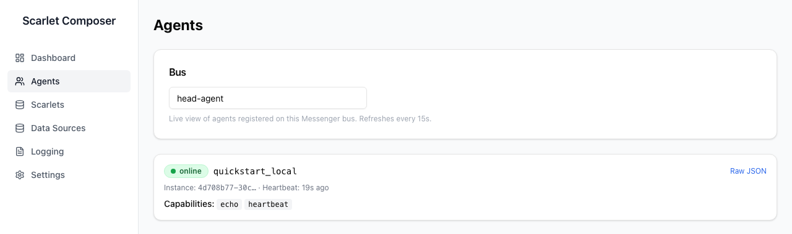

# Agents Page

Shows every agent currently registered on a given Messenger bus, refreshed
every 15s.

---

## Bus selector

Enter the bus name to inspect (defaults to `head-agent`) — the page shows
whichever agents have called `Messenger.ReportStatus()`/`Register()` on
that bus.

## Agent card

Each card shows:

| Field | Source |
|---|---|
| Status indicator | Time since last heartbeat vs. `STALE_THRESHOLD` |
| Agent ID | `agentId` passed to `Messenger` |
| Instance ID | First 12 characters, for distinguishing restarts of the same agent ID |
| Heartbeat | Relative time since the last status report |
| Capabilities | Skills/capabilities the agent reported |
| Data sources | Name, connector type, mode (`local`/`broker`), and description — populated by [harness](../harness/concepts.md#local-first-data-access) workers with a local `~/.scarlet/config.yaml` |
| Raw JSON | Toggle to see the full status record composer-api returned |

No agents registered on the entered bus name shows an explicit empty
state, not a blank page.
