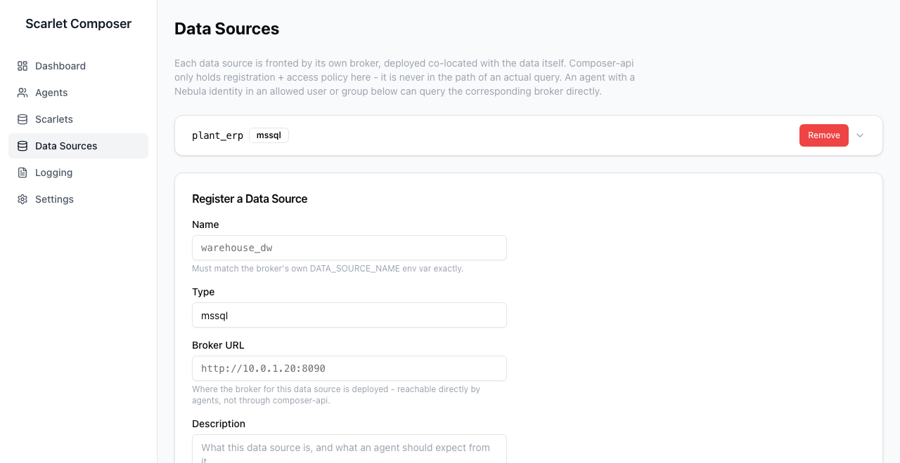

# Data Sources Page

Manages the **centralized** data-source registry — the broker path for
genuinely shared sources. This is one of two ways an agent reaches a data
source; for a site-owned source that shouldn't be centralized at all, see
[Local-First Data Access](../harness/concepts.md#local-first-data-access).



---

## What this registry actually holds

A YAML-backed list (`/etc/scarlet-composer/data_sources.yaml`), each entry:

```yaml
data_sources:
  - name: plant_erp
    type: mssql
    broker_url: "https://broker.example.com"
    description: "Corporate ERP inventory figures."
    allowed_users: []
    allowed_groups: ["plant-ops"]
```

**No credential is ever stored here.** The registry holds *authorization
policy and a directory of where to find each broker* — `{name, type,
broker_url, description, allowed_users, allowed_groups}` — nothing more.
The actual database credential lives only in that broker's own deployment
(its own environment variables, set once when the broker container is
deployed), never returned by, sent to, or stored in composer-api.

---

## Authorization

`allowed_users`/`allowed_groups` are checked against the calling agent's
session (Nebula group membership, the same mechanism Gustavo's own
app/device-group access grants use) before a query is allowed through —
`POST /api/data-sources/{name}/authorize`. Creating, editing, or deleting
an entry requires an admin session; any authenticated session can list
entries and request authorization to query one.

---

## In the UI

The **Register a Data Source** form (always visible below the list, no
modal) takes **Name** (must match the broker's own `DATA_SOURCE_NAME` env
var exactly), connector **Type**, the broker's **URL** — reachable
directly by agents, not through composer-api — a natural-language
**Description** (fed into agent context, the same role a scarlet's own
description plays), and comma-separated **allowed users**/**allowed
Nebula groups**.

An agent's own `query_feature` skill call goes through this registry only
when its `~/.scarlet/config.yaml` entry is `mode: broker` — a `mode: local`
entry never touches this page or composer-api at all.
