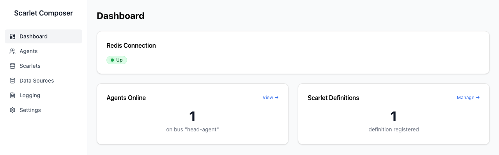

# Composer UI — Overview

The operator dashboard for a Scarlet deployment — see the [Architecture at a Glance](../index.md#architecture-at-a-glance) section for how it fits into the rest of the system. Two processes in one container: `composer-api` (FastAPI, talks to Redis) and `composer-ui` (Next.js, the browser client) — the UI never talks to Redis directly.

---

## Launch

```bash
docker run -d -p 8501:3000 \
  -e REDIS_HOST=your-redis-host \
  -e REDIS_AUTH_TOKEN=your-password \
  -e AUTH_ENABLED=false \
  ghcr.io/disys-lab/scarlet-composer:latest
```

Open **http://localhost:8501** in a browser. See [Docker Images](../deployment/docker.md) for building locally and running `background-server` alongside it.



---

## Sidebar

| Page | What it's for |
|---|---|
| **Dashboard** | Redis health, agent/scarlet counts at a glance |
| **[Agents](agents.md)** | Live agent registry — status, capabilities, data sources |
| **Scarlets** | Registered scarlet definitions; interpret and deploy from source |
| **[Data Sources](data-sources.md)** | The centralized data-source broker registry |
| **[Logging](logging.md)** | Live tail of the `RedisLogger` stream |
| **Settings** | Composer-api configuration |

Redis connection details are set once, server-side, via environment
variables at container start — there's no in-browser "connect" step.

---

## Authentication

When `AUTH_ENABLED=true`, every page redirects to `/login` until a Nebula-backed
session is established. `NEXT_PUBLIC_AUTH_ENABLED` (a build-time flag, not
runtime) must be set to match — see
[Environment Variables](../deployment/env-vars.md).

---

## Automatic Refresh

The Agents page polls composer-api periodically; agents that haven't sent a
heartbeat within `STALE_THRESHOLD` seconds (default 120) show a stale
indicator.
