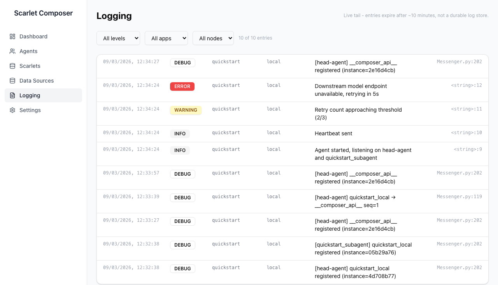

# Logging Page

The **Logging** tab displays structured log entries written by agents using `RedisLogger`. Operators can filter by App ID and Node IP.

---

## RedisLogger

`RedisLogger` is a static utility class — no constructor, no instance required. Import it and call the log methods directly:

```python
from scarlets.utils.RedisLogger import RedisLogger

RedisLogger.info("Agent started")
RedisLogger.warning("Retry count exceeded threshold")
RedisLogger.error("Downstream model unavailable")
```

### Identity

Each log entry carries an `app` field (from `APP_ID` env var) and a `node` field (from `NODE_ADDRESS` env var). These are set automatically:

- When your agent extends `ScarletBase`, identity is resolved during `__init__`.
- When your agent uses only `Messenger`, identity is read from env vars in `Messenger.__init__`.

You can also set them manually before logging:

```python
RedisLogger.app_id = "my-app"
RedisLogger.nodeIp  = "10.42.0.5"
```

### Log levels

| Method | Level field in Redis |
|---|---|
| `RedisLogger.debug(msg)` | `DEBUG` |
| `RedisLogger.info(msg)` | `INFO` |
| `RedisLogger.warning(msg)` | `WARNING` |
| `RedisLogger.error(msg)` | `ERROR` |
| `RedisLogger.critical(msg)` | `CRITICAL` |

Each call also writes to the local Python `logging` handler (stdout / file, depending on your container config).

---

## Redis Storage

Each log entry is stored as a Redis Hash at a unique key:

```
logs_{uuid4}
```

Hash fields:

| Field | Description |
|---|---|
| `time` | Unix timestamp (float) |
| `app` | `RedisLogger.app_id` at call time |
| `node` | `RedisLogger.nodeIp` at call time |
| `file` | Absolute path of the calling source file |
| `filename` | Same as `file` |
| `line` | Line number of the calling statement |
| `level` | `DEBUG` / `INFO` / `WARNING` / `ERROR` / `CRITICAL` |
| `msg` | Log message string |

Keys expire automatically after `RedisLogger.expiry_time` seconds (default **600 s**). To extend retention before your agent starts:

```python
RedisLogger.expiry_time = 3600  # 1 hour
```

---

## Viewing Logs in the UI



`GET /api/logs` scans every `logs_*` key, same data source as always, and
returns the full set — filtering by app/node/level happens client-side in
composer-ui, matching each entry against **all** active filters together
(app **and** node **and** level), not any one of them.

This is a live tail, not durable history: `RedisLogger`'s 10-minute TTL
means anything older is already gone from Redis by the time you'd look for
it. For durable retention, ship logs somewhere else (e.g. Loki) — this page
can't add history that Redis no longer has.

### Filters

| Filter | Description |
|---|---|
| **App** | Show entries from one `APP_ID` or all |
| **Node** | Show entries from one `NODE_ADDRESS` or all |
| **Level** | `DEBUG`/`INFO`/`WARNING`/`ERROR`/`CRITICAL` or all |

---

## Querying Logs Directly

```python
import redis, os

r = redis.Redis(
    host=os.environ["REDIS_HOST"],
    port=int(os.environ["REDIS_PORT"]),
    password=os.environ["REDIS_AUTH_TOKEN"],
    decode_responses=True,
)

# Collect all log keys
cursor, keys = 0, []
while True:
    cursor, batch = r.scan(cursor=cursor, match="logs_*", count=100)
    keys.extend(batch)
    if cursor == 0:
        break

# Fetch entries for a specific app
logs = [r.hgetall(k) for k in keys if r.hget(k, "app") == "hello-agent"]
```
